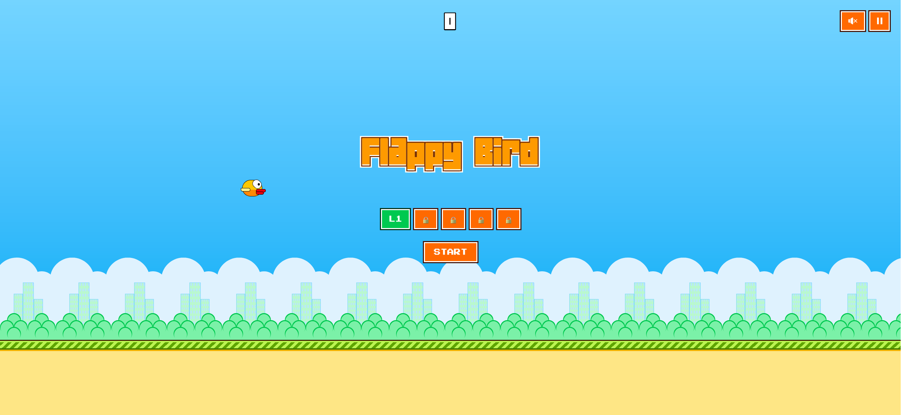

# Flappy Bird React

A modernized version of the classic Flappy Bird game built with React, TypeScript, and Tailwind CSS.



## Features

- **Progressive Difficulty:** 5 distinct levels (Kids, Amateur, Pro, Master, Legend) with increasing speed, gravity, and tighter gaps.
- **Modern UI:** Clean, pixel-art aesthetic with responsive design for both desktop and mobile.
- **Scoreboard:** Wooden-style scoreboard tracking current and best scores per level.
- **Smooth Animations:** Fade-in overlays, sliding panels, and a "Get Ready" sequence.
- **Audio System:** Retro-style sound effects for flapping, scoring, hitting obstacles, and leveling up.
- **Persistent Storage:** Best scores and unlocked levels are saved locally in your browser.

## Tech Stack

- **Framework:** React 19
- **Build Tool:** Vite 8
- **Styling:** Tailwind CSS 4
- **Language:** TypeScript
- **State Management:** React Hooks (useRef, useEffect, useMemo, useState)

## Getting Started

### Prerequisites

- Node.js (latest version recommended)
- npm or yarn

### Installation

1. Clone the repository:
   ```bash
   git clone https://github.com/your-username/flappy-bird.git
   ```

2. Install dependencies:
   ```bash
   npm install
   ```

3. Start the development server:
   ```bash
   npm run dev
   ```

4. Open your browser and navigate to `http://localhost:3000`.

## Controls

- **Space / Up Arrow:** Flap
- **Enter:** Start Game
- **P / Escape:** Pause / Resume
- **R:** Reset Level

## Game Mechanics

- **Score 10 points** to unlock the next level.
- **Level Up:** Each level increases the environment speed and adjusts physics for a greater challenge.
- **Medals:** Earn Bronze, Silver, or Gold medals based on your score.

## Project Structure

- `src/game/GameView.tsx`: Main game loop and state management.
- `src/game/components/`: Reusable game UI components (ScoreBoard, HUD, Overlay, etc.).
- `src/game/levels.ts`: Level configuration data.
- `src/game/sfx.ts`: Web Audio API based sound system.
- `src/game/storage.ts`: LocalStorage wrapper for persistence.

---

Built with ❤️ by MKK
